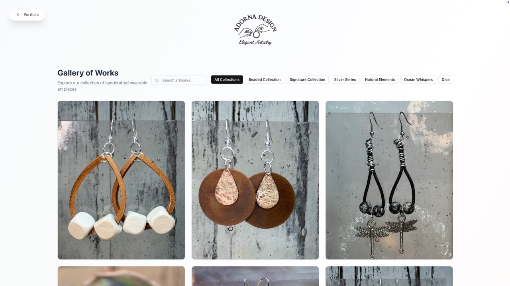
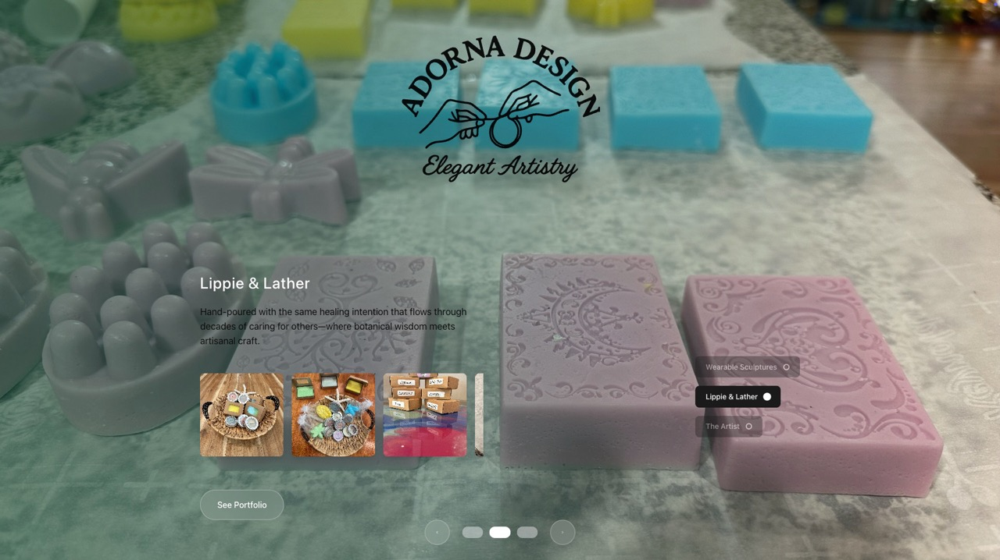

# 🎨 Adorna Design - Portfolio Website

> **An elegant digital showcase for Gina's multi-disciplinary artistry**

Adorna Design represents the convergence of three decades of healing work and artistic expression. This portfolio website showcases handcrafted jewelry, botanical skincare, and artistic design—all created with the precision and care that comes from a lifetime of nurturing others.

## 📸 Screenshots

### Front Page Carousel

*Cinematic full-screen carousel showcasing the artistic collections with elegant navigation*

### Jewelry Gallery

*Clean, paginated presentation of handcrafted earrings with photography credits and filtering*

### Lippie & Lather Collection

*Botanical skincare collection with product filtering and detailed descriptions*

## ✨ Features

### 🎭 **Immersive Portfolio Experience**
- **Cinematic Carousel**: Full-screen hero sections with smooth transitions
- **Three Collections**: Jewelry, Skincare, and Artist Biography
- **Clean Aesthetic**: Professional presentation focusing on the artistry
- **Responsive Design**: Optimized for desktop, tablet, and mobile devices

### 🎨 **Artistic Sections**
- **Wearable Sculptures**: Handcrafted jewelry with categorized gallery
- **Lippie & Lather**: Botanical skincare and soap artistry
- **The Artist**: Comprehensive biography and artistic journey

### 🚀 **Performance Features**
- **Lazy Loading**: Images load only when visible
- **Pagination**: "Load More" system for better performance
- **Loading Skeletons**: Smooth loading experience
- **Category Filtering**: Organized by material and style
- **Photography Credits**: Proper attribution to Danielle Osfalg

### 🛠️ **Technical Excellence**
- **React + TypeScript**: Modern, type-safe development
- **Tailwind CSS**: Utility-first styling with responsive design
- **Vite**: Lightning-fast development and optimized builds
- **Docker Deployment**: Containerized with configurable port selection
- **Interactive Deploy Script**: User-friendly deployment with port validation

## 🛠️ Technology Stack

- **Frontend**: React 18, TypeScript, Tailwind CSS
- **Build Tool**: Vite
- **UI Components**: Radix UI, shadcn/ui
- **Icons**: Lucide React
- **Deployment**: Docker, Docker Compose
- **Development**: ESLint, PostCSS, Autoprefixer

## 🚀 Quick Start

### Prerequisites
- Docker and Docker Compose installed
- Git for cloning the repository

### Deployment

1. **Clone the repository**
   ```bash
   git clone https://github.com/yourusername/adorna-design.git
   cd adorna-design
   ```

2. **Run the interactive deployment script**
   ```bash
   ./deploy.sh
   ```

3. **Follow the prompts**
   - Choose your preferred port (default: 6464)
   - Confirm deployment settings
   - Access your site at `http://localhost:YOUR_PORT`

### Development Mode

For local development without Docker:

```bash
# Install dependencies
npm install

# Start development server
npm run dev

# Build for production
npm run build

# Preview production build
npm run preview
```

## 🐳 Docker Management

The project includes convenient Docker management commands:

```bash
# Build and start container
npm run docker:up

# Stop container
npm run docker:down

# View logs
npm run docker:logs

# Rebuild and deploy on different port
./deploy.sh
```

## 🖼️ Image Setup

To replace placeholder images with actual artwork:

1. **Read the setup guide**: See `IMAGE_SETUP.md` for detailed instructions
2. **Organize your images**: Follow the specified directory structure
3. **Update image paths**: Modify the component files to reference your images
4. **Rebuild container**: Run `./deploy.sh` to deploy with new images

## 🎯 Project Structure

```
adorna-design/
├── src/
│   ├── components/          # React components
│   │   ├── Gallery.tsx      # Jewelry collection
│   │   ├── LippieAndLather.tsx
│   │   ├── OtherCrafts.tsx
│   │   └── About.tsx
│   ├── App.tsx             # Main carousel application
│   └── main.tsx            # Application entry point
├── public/
│   └── images/             # Static image assets
├── docker-compose.yaml     # Container orchestration
├── Dockerfile             # Container definition
├── deploy.sh              # Interactive deployment script
└── IMAGE_SETUP.md         # Image replacement guide
```

## 🎨 Design Philosophy

This portfolio embodies the intersection of healing and artistry:

- **Museum-Quality Aesthetic**: Clean, sophisticated presentation that honors the artwork
- **Anti-Commercial Design**: Focus on artistic merit rather than sales-driven layouts  
- **Narrative Integration**: Weaving together 30+ years of nursing experience with creative expression
- **Attention to Detail**: Reflecting the precision that comes from medical training
- **Healing Through Beauty**: Creating spaces that nurture both artist and viewer

## 🌟 Artist Background

**Gina** brings three decades of intensive care nursing experience to her multi-disciplinary artistry. Her work spans:

- **Handcrafted Jewelry**: One-of-a-kind earrings and wearable sculptures
- **Botanical Skincare**: Small-batch lip balms and natural soaps under "Lippie & Lather"
- **Home Artistry**: Custom furniture, garden design, and architectural enhancements
- **Artistic Design**: Transforming healing work into moments of artistic design

## 📄 License

This project showcases original artwork by Gina. All artistic works are protected by copyright. The website code is available for reference and learning purposes.

## 🤝 Contributing

This is a portfolio website for a specific artist. For technical improvements or bug fixes, please open an issue or submit a pull request.

## 📞 Contact

**Adorna Design**  
Gina - Multi-Media Artist  
*Creating art that bridges the worlds of healing and beauty*

---

<div align="center">

**Website crafted with ❤️ by [Magic Unicorn Unconventional Technology & Stuff Inc](https://magicunicorn.tech) using [Unicorn Commander UC-1](https://unicorncommander.com)**

*Transforming artistic vision into digital reality*

</div>
