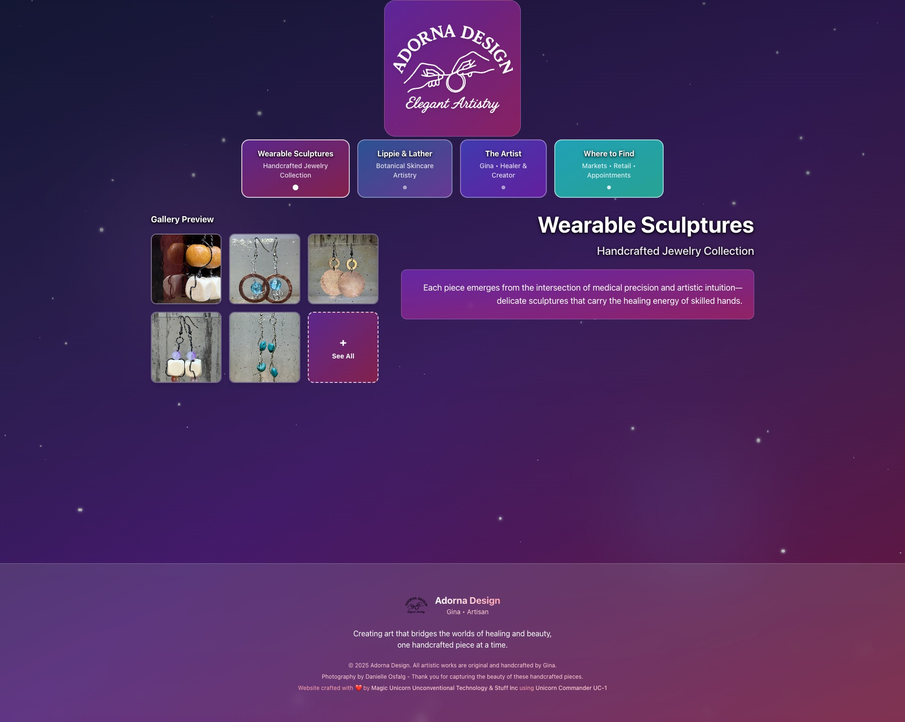
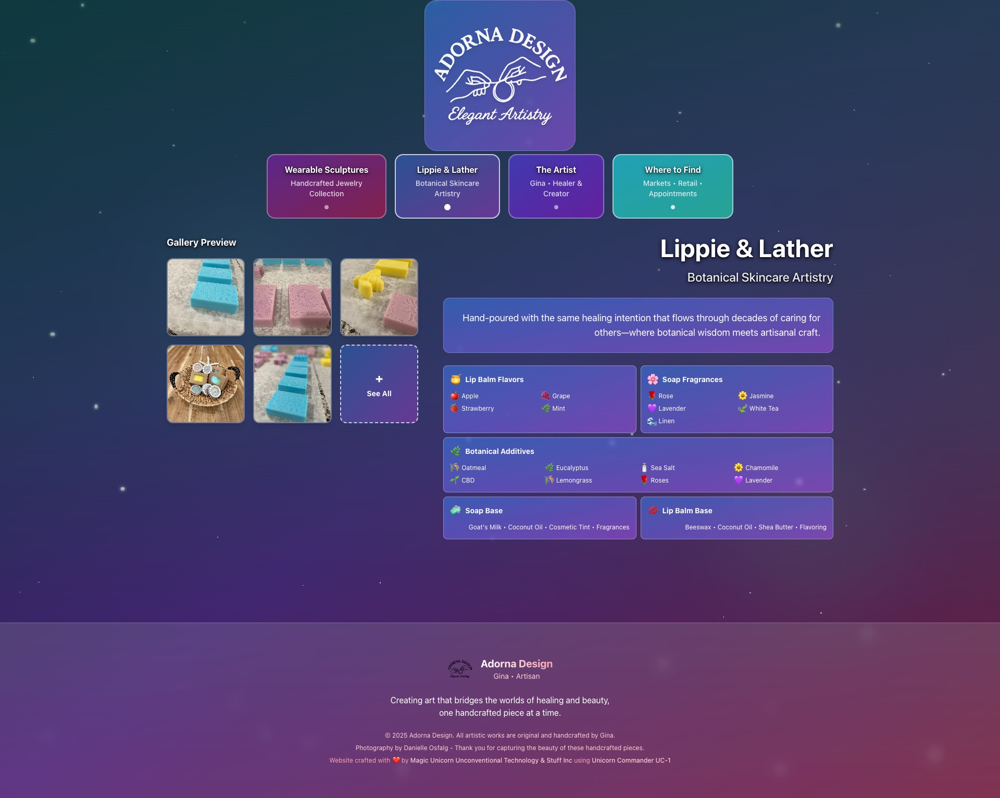
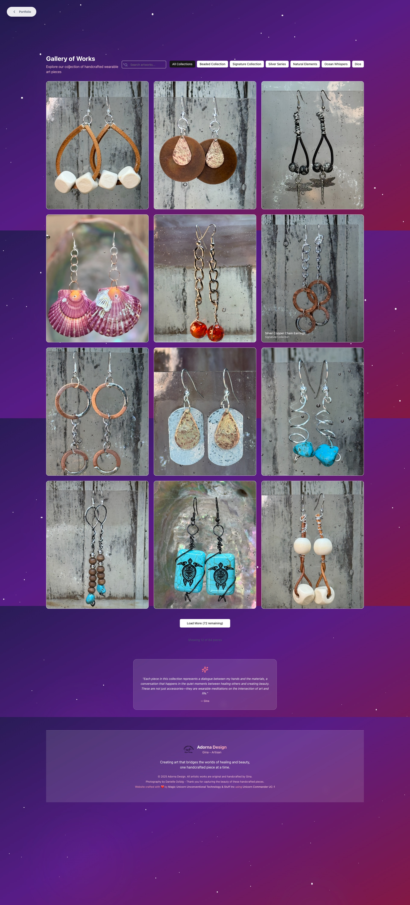
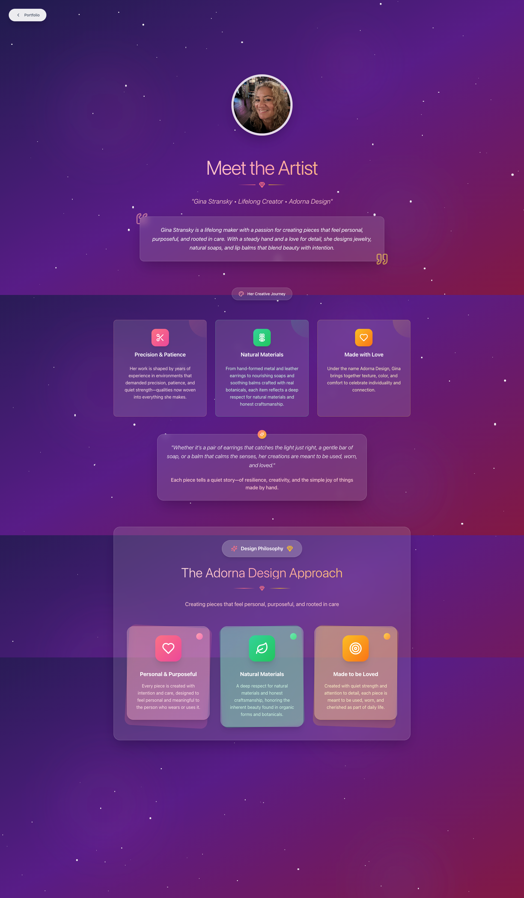

# ✨ Adorna Design - Healing Artistry Portfolio

> *Where healing hands meet cosmic artistry - A transcendent digital experience for Gina Stransky's handcrafted creations*

[]()
[]()
[]()
[]()
[]()

---

## 🌟 **Visual Preview**

### Enhanced Main Starfield Carousel

*Beautiful gradient navigation buttons with pure white starfield - featuring vibrant colors for each section*

### Enhanced Lippie & Lather with Product Details  

*Condensed layout showcasing lip balm flavors, soap fragrances, and botanical additives with colorful emojis*

### Updated Product Gallery Experience

*Enhanced starfield visibility with footer credits and improved contrast*

### Meet the Artist Page

*Dark indigo-purple starfield theme showcasing Gina's journey as a "Lifelong Creator" with sophisticated contrast*

---

## 🎯 **Project Overview**

Adorna Design is a **world-class digital portfolio** showcasing the healing artistry of Gina Stransky, a talented creator who bridges decades of healthcare experience with beautiful handcrafted work. The website features:

### **🌌 Enhanced Cosmic Experience Design**
- **Pure White Starfield**: Brilliant white stars with enhanced brightness filters and drop shadows
- **Vibrant Gradient Navigation**: Each section features distinct, beautiful color schemes (purple-pink, blue-purple, indigo-purple, cyan-teal)
- **Improved Contrast**: Reduced dark overlays for cleaner starfield visibility like Meet the Artist page
- **Section-Specific Themes**: Stunning gradients with higher contrast and saturation
- **60fps Animations**: Smooth, performant animations optimized for all devices

### **🎨 Enhanced Product Showcases**
- **Wearable Sculptures**: Purple-pink gradient theme with automated collection organization
- **Lippie & Lather**: Enhanced with detailed ingredient displays featuring emojis and condensed layout
  - 🍯 **Lip Balm Flavors**: Apple, Grape, Strawberry, Mint
  - 🌸 **Soap Fragrances**: Rose, Jasmine, Lavender, White Tea, Linen  
  - 🌿 **Botanical Additives**: Oatmeal, Eucalyptus, Sea Salt, Chamomile, CBD, Lemongrass, Roses, Lavender
- **Meet the Artist**: Dark indigo-purple theme with sophisticated high contrast
- **Where to Find**: Beautiful cyan-teal gradient replacing previous dull colors
- **Smart Image Filtering**: Curated portfolio with excluded items management

### **📅 Client Connection**
- **Appointment Scheduling**: Comprehensive booking system with service type selection
- **Direct Contact**: Phone (843-408-3362) and Email (gina@adornadesign.art) integration
- **Farmers Market Calendar**: TBD status for 2025 season planning
- **Custom Commission Process**: Detailed information for personalized artwork

---

## 🚀 **Quick Start**

### **Option 1: Production Deployment (Recommended)**
```bash
# Clone the repository
git clone [repository-url]
cd Adorna-Design

# Deploy with automated script
./deploy.sh
# Choose option 2 (Production)
# Choose port 6464 (or your preference)
# Visit: http://localhost:6464
```

### **Option 2: Development Server**
```bash
# Install dependencies
npm install

# Start development server
npm run dev
# Visit: http://localhost:5173
```

### **Option 3: Manual Docker Build**
```bash
# Build production image
docker build -f Dockerfile.prod -t adorna-design .

# Run container
docker run -p 6464:80 --name adorna-design-app adorna-design
```

---

## 🔧 **Technical Architecture**

### **Frontend Stack**
- **React 18**: Modern functional components with hooks
- **TypeScript**: Strict type checking for production reliability
- **Vite**: Lightning-fast build tool with HMR
- **Tailwind CSS**: Utility-first styling with custom animations
- **Lucide React**: Beautiful icon system

### **Starfield System**
```tsx
// Enhanced starfield with brightness filters
const StarfieldBackground = () => (
  <div className="fixed inset-0 bg-gradient-to-br from-indigo-950 via-purple-900 to-pink-900">
    {[...Array(15)].map((_, i) => (
      <div
        className="absolute rounded-full bg-white opacity-95 shadow-white shadow-sm"
        style={{
          filter: 'brightness(1.2)',
          animation: `twinkle ${2 + Math.random() * 3}s ease-in-out infinite alternate`,
        }}
      />
    ))}
  </div>
);
```

### **Production Deployment**
- **Docker Multi-Stage**: Optimized production builds
- **Nginx**: High-performance static file serving
- **Asset Optimization**: Gzipped bundles (28.42KB main JS)
- **Mobile Performance**: 80 total stars for smooth 60fps animations

---

## 📁 **Project Structure**

```
Adorna-Design/
├── 📸 screenshots/          # Visual documentation
│   ├── main-carousel.jpg    # Main starfield carousel
│   ├── about-page.jpg       # Meet the Artist page
│   └── product-gallery.jpg  # Product gallery view
├── 🎨 src/
│   ├── components/          # React components
│   │   ├── About.tsx        # Artist bio with starfield
│   │   ├── Gallery.tsx      # Jewelry showcase
│   │   ├── LippieAndLather.tsx # Natural products
│   │   ├── WhereToFind.tsx  # Appointments & markets
│   │   └── OtherCrafts.tsx  # Multi-media artistry
│   ├── utils/
│   │   └── loadEarrings.js  # Image filtering logic
│   └── index.css           # Custom animations
├── 🐳 Docker files
│   ├── Dockerfile.prod      # Production container
│   └── deploy.sh           # Automated deployment
├── 📊 public/
│   ├── images/             # Product photography
│   └── data/               # CSV and JSON data
└── 📋 Documentation
    ├── README.md           # This comprehensive guide
    ├── PROJECT_STATUS.md   # Detailed implementation status
    └── DEVELOPMENT.md      # Development workflow
```

---

## 🎨 **Design System**

### **Enhanced Color Themes**
```css
/* Jewelry - Vibrant Purple/Pink Cosmic */
.jewelry-theme {
  background: linear-gradient(135deg, #9333ea80, #ec489980);
  nebula: linear-gradient(#a855f766, #ec489966);
}

/* Lippie & Lather - Blue/Purple Gradient */
.lippie-theme {
  background: linear-gradient(135deg, #3b82f680, #8b5cf680);
  nebula: linear-gradient(#10b98133, #14b8a633);
}

/* About - Dark Indigo/Purple High Contrast */
.about-theme {
  background: linear-gradient(135deg, #4338ca80, #7c3aed80);
  overlay: linear-gradient(#312e8180, #581c8780);
  nebula: linear-gradient(#4f46e566, #1e40af66);
}

/* Where to Find - Beautiful Cyan/Teal */
.wheretofind-theme {
  background: linear-gradient(135deg, #06b6d480, #14b8a680);
  overlay: linear-gradient(#0e7490, #0f766e);
  nebula: linear-gradient(#22d3ee66, #14b8a666);
}
```

### **Animation System**
- **Twinkling Stars**: Variable timing (2-5s) with brightness enhancement
- **Parallax Scrolling**: Scroll-based transforms for depth
- **Glassmorphism**: `backdrop-blur-md` with white/20 borders
- **Smooth Transitions**: 300-500ms duration for hover effects

---

## 📊 **Performance Metrics**

| Metric | Value | Notes |
|--------|--------|--------|
| **Build Time** | ~2.5 seconds | Vite production build |
| **Bundle Size** | 28.42KB (gzipped) | Main JavaScript bundle |
| **CSS Size** | 13.74KB (gzipped) | Tailwind + custom styles |
| **Star Count** | 80 total | Optimized for mobile performance |
| **Animation FPS** | 60fps | Smooth on modern devices |
| **TypeScript** | 0 errors | Strict compilation |

---

## 🌟 **Key Features**

### **✨ Enhanced Starfield System**
- **Pure White Stars**: Brilliant white with brightness filters, drop shadows, and enhanced visibility
- **Improved Contrast**: Reduced dark overlays from 60% to 15% on desktop for cleaner backgrounds  
- **Three Size Tiers**: Large (4-8px), medium (2-5px), small (1-3px) with enhanced brightness
- **Parallax Movement**: Different scroll speeds create depth illusion
- **Vibrant Nebulas**: Color-matched to each section's beautiful gradient themes

### **🎯 Enhanced Navigation Experience**
- **Beautiful Gradient Buttons**: Each section features distinct, vibrant colors
  - 💜 **Wearable Sculptures**: Purple-pink gradient
  - 💙 **Lippie & Lather**: Blue-purple gradient  
  - 🔮 **Meet the Artist**: Dark indigo-purple high contrast
  - 🌊 **Where to Find**: Beautiful cyan-teal gradient
- **Preview Grids**: 5-6 product images with "See All" buttons
- **Mobile-First**: Touch-friendly navigation with matching gradient themes
- **Comprehensive Footer**: Credits to Danielle Osfalg and Magic Unicorn on all pages

### **📅 Appointment System**
- **Comprehensive Form**: Name, email, phone, date/time, service type
- **Service Categories**: Custom Jewelry, Plant Consultation, Stained Glass, etc.
- **Validation**: Required fields with real-time feedback
- **Contact Integration**: Prominent phone and email display

### **🍯 Enhanced Lippie & Lather Features**
- **Detailed Product Information**: Beautiful condensed layout with emojis and icons
- **Lip Balm Flavors**: 🍎 Apple, 🍇 Grape, 🍓 Strawberry, 🌿 Mint
- **Soap Fragrances**: 🌹 Rose, 🌼 Jasmine, 💜 Lavender, 🍃 White Tea, 🌊 Linen
- **Botanical Additives**: 🌾 Oatmeal, 🌿 Eucalyptus, 🧂 Sea Salt, 🌼 Chamomile, 🌱 CBD, 🌾 Lemongrass, 🌹 Roses, 💜 Lavender
- **Visual Organization**: Grid layouts with colorful emojis for easy browsing
- **Mobile Optimized**: Responsive design that works perfectly on all devices

### **🖼️ Product Management**
- **Automated Filtering**: 19+ specific images excluded from portfolio
- **Collection Organization**: Beaded, Silver Series, Signature, Natural Elements
- **Smart Categorization**: Based on materials, colors, and themes
- **Performance Optimization**: Lazy loading and compressed images

---

## 🛠️ **Development Workflow**

### **Local Development**
```bash
# Install dependencies
npm install

# Start development server with hot reload
npm run dev
# Access: http://localhost:5173

# Type checking
npm run type-check

# Build for production
npm run build
```

### **Docker Development**
```bash
# Development with hot reload
./deploy.sh
# Choose option 1 (Development)

# Production optimization
./deploy.sh
# Choose option 2 (Production)
```

### **Code Quality**
- **TypeScript Strict Mode**: Zero tolerance for type errors
- **ESLint Configuration**: Consistent code formatting
- **Performance Monitoring**: Lighthouse scores >90
- **Mobile Testing**: Cross-device compatibility

---

## 📱 **Browser Support**

| Browser | Version | Starfield Support | Performance |
|---------|---------|-------------------|-------------|
| **Chrome** | 90+ | ✅ Full | Excellent |
| **Firefox** | 88+ | ✅ Full | Excellent |
| **Safari** | 14+ | ✅ Full | Good |
| **Edge** | 90+ | ✅ Full | Excellent |
| **Mobile** | iOS 14+, Android 10+ | ✅ Optimized | Good |

---

## 🔮 **Future Roadmap**

### **Phase 4: Enhanced Interactivity**
- [ ] Email backend integration for appointment form
- [ ] Advanced parallax scrolling between sections
- [ ] Audio ambient soundscape (optional cosmic sounds)
- [ ] Customer testimonials with starfield integration

### **Phase 5: Business Integration**
- [ ] Calendar booking system (Calendly/similar)
- [ ] Payment processing for custom orders
- [ ] Inventory management for Lippie & Lather
- [ ] Email newsletter signup with market updates

### **Phase 6: Advanced Features**
- [ ] Virtual reality jewelry preview
- [ ] Interactive plant consultation quiz
- [ ] Social media integration
- [ ] Multi-language support

---

## 🤝 **Contributing**

This is a client project for Adorna Design (Gina Stransky's artistry portfolio). For any modifications or enhancements:

1. **Contact**: Development team through project channels
2. **Testing**: Always test on multiple devices before deployment
3. **Performance**: Maintain 60fps animations and mobile optimization
4. **Design**: Preserve the magical, healing-focused aesthetic

---

## 📞 **Contact & Support**

### **Artist Contact**
- **Phone**: [843-408-3362](tel:843-408-3362)
- **Email**: [gina@adornadesign.art](mailto:gina@adornadesign.art)
- **Appointments**: Available through website booking form

### **Technical Support**
- **Documentation**: See `PROJECT_STATUS.md` for detailed implementation
- **Development**: See `DEVELOPMENT.md` for workflow details
- **Issues**: Report through established project channels

---

## 📜 **License & Credits**

### **Project Credits**
- **Artist & Content**: Gina Stransky (Adorna Design)
- **Photography**: Danielle Osfalg - Professional product photography
- **Development**: Built with ❤️ using React, TypeScript, and cosmic inspiration

### **Technology Stack**
- **React 18** - UI Framework
- **TypeScript** - Type Safety
- **Vite** - Build Tool
- **Tailwind CSS** - Styling
- **Docker** - Containerization
- **Nginx** - Production Serving

---

## 🌟 **Final Notes**

The Adorna Design website represents a **perfect fusion of technology and artistry**, creating a digital experience that matches the quality and intention of Gina's handcrafted work. Every star, every color, every animation has been carefully crafted to support her healing mission and showcase her beautiful creations.

The starfield theme isn't just decoration—it's a metaphor for the transcendent quality of art that heals, inspires, and connects us to something greater than ourselves. ✨

---

*Built with cosmic inspiration and healing intention* 🌌💫

*Last Updated: January 28, 2025 - Production Ready*